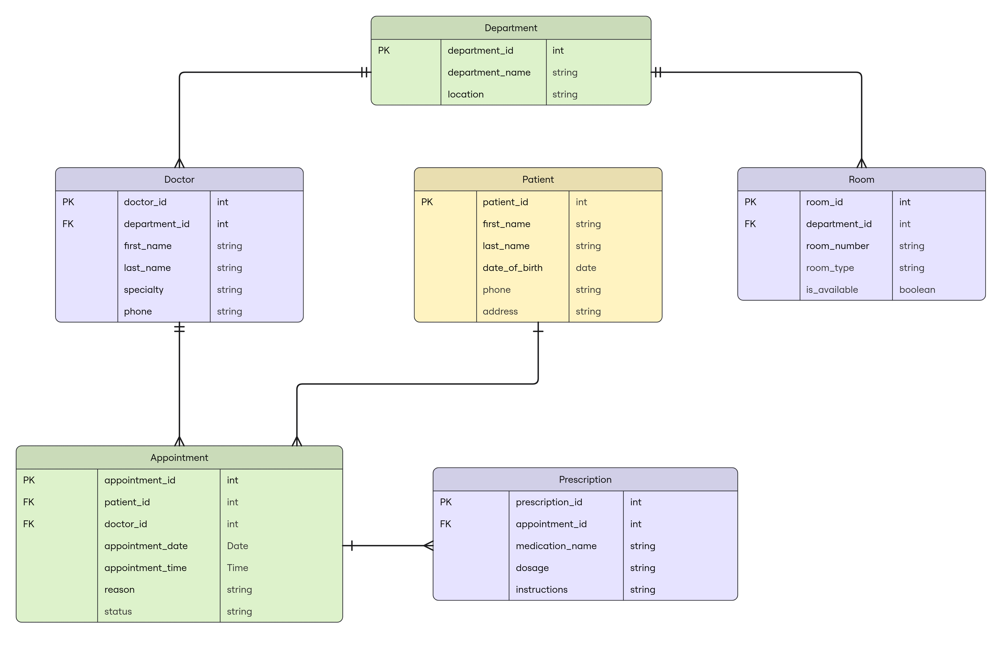

# Exercise — Hospital Schema

Given the following ERD, provide SQL statements that will create each of the six tables depicted. Ensure that all primary key and foreign key relationships shown in the diagram are reflected in your table definitions.

**Tables to create:** Department, Doctor, Patient, Appointment, Prescription, Room

**ERD Relationship Summary**

| Relationship | Type |
|-|-|
| Department → Doctor | One-to-many |
| Department → Room | One-to-many |
| Doctor → Appointment | One-to-many |
| Patient → Appointment | One-to-many |
| Appointment → Prescription | One-to-many |

**Column Reference**

Department
| column | type |
|-|-|
| department_id | int |
| department_name | varchar |
| location | varchar |

Doctor
| column | type |
|-|-|
| doctor_id | int |
| department_id | int (FK → Department) |
| first_name | varchar |
| last_name | varchar |
| specialty | varchar |
| phone | varchar |

Patient
| column | type |
|-|-|
| patient_id | int |
| first_name | varchar |
| last_name | varchar |
| date_of_birth | date |
| phone | varchar |
| address | varchar |

Appointment
| column | type |
|-|-|
| appointment_id | int |
| patient_id | int (FK → Patient) |
| doctor_id | int (FK → Doctor) |
| appointment_date | date |
| appointment_time | time |
| reason | varchar |
| status | varchar |

Prescription
| column | type |
|-|-|
| prescription_id | int |
| appointment_id | int (FK → Appointment) |
| medication_name | varchar |
| dosage | varchar |
| instructions | varchar |

Room
| column | type |
|-|-|
| room_id | int |
| department_id | int (FK → Department) |
| room_number | varchar |
| room_type | varchar |
| is_available | boolean |
